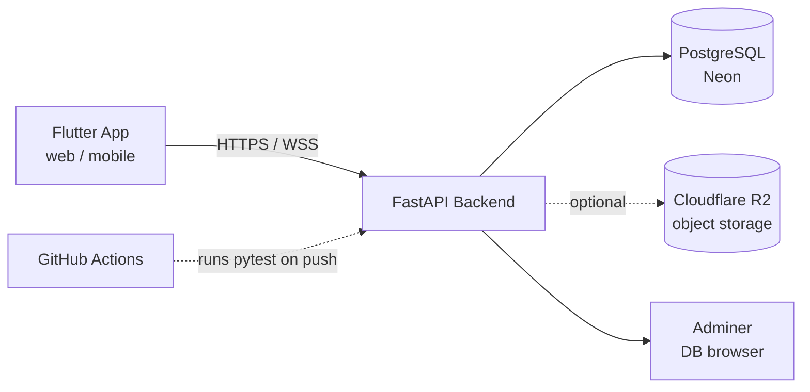

# OsonIjara — Backend


The backend API for **OsonIjara**, a full-stack rental-listing platform —
JWT auth, property listings with search/filters, image uploads, bookmarks,
real-time chat over WebSockets, and a minimal admin role, all Dockerized and
covered by an automated test suite.

**Live API:** [oson-ijara-backend.onrender.com](https://oson-ijara-backend.onrender.com)
**Interactive docs:** [oson-ijara-backend.onrender.com/docs](https://oson-ijara-backend.onrender.com/docs)
**Frontend repo:** [oson-ijara-app](https://github.com/javohir-io/oson-ijara-app) · **Live app:** [osonuyjoy.netlify.app](https://osonuyjoy.netlify.app)

> The backend runs on a free-tier host that sleeps after 15 minutes of
> inactivity — the first request after a while may take 10–50s to wake it up.

---

## Features

- 🔐 **JWT authentication** — register/login, password hashing with bcrypt
- 🏠 **Property listings** — full CRUD, ownership checks, rich filtering
  (location, price range, bedrooms/bathrooms, renovation, amenities, search)
- 🖼️ **Image uploads** — avatars and property photos, with a swappable
  storage backend (local disk by default, or Cloudflare R2 via env vars)
- 🔖 **Bookmarks** — save/unsave listings
- 💬 **Real-time chat** — WebSocket-based messaging between users, with a
  REST fallback and conversation/unread-count tracking
- 🛡️ **Admin role** — moderate any listing or user, view basic stats
- ✅ **Automated tests** — 26 pytest tests covering auth, properties, chat,
  and admin permissions, running in CI on every push
- 🐳 **Dockerized** — API, Postgres, and a DB admin UI (Adminer) via one
  `docker compose up`

## Tech stack

| Layer | Choice |
|---|---|
| Framework | FastAPI (Python 3.12) |
| Database | PostgreSQL ([Neon](https://neon.tech), serverless Postgres) |
| ORM | SQLAlchemy 2.0 |
| Auth | JWT (`python-jose`) + `passlib`/bcrypt |
| Real-time | WebSockets (native, via `uvicorn[standard]`) |
| File storage | Local disk, or Cloudflare R2 (S3-compatible) |
| Testing | pytest + FastAPI `TestClient`, SQLite for isolation |
| CI/CD | GitHub Actions |
| Deployment | Docker → [Render](https://render.com) |

## Architecture



## API overview

Full interactive docs (with request/response schemas) are auto-generated at
[`/docs`](https://oson-ijara-backend.onrender.com/docs). Highlights:

| Method | Path | Description |
|---|---|---|
| POST | `/auth/register` / `/auth/login` | Auth, returns a JWT |
| GET | `/auth/me` | Current user |
| GET | `/properties` | List + filter listings |
| POST / PUT / DELETE | `/properties/{id}` | Manage a listing (owner-only) |
| POST | `/properties/{id}/images` | Upload listing photos |
| POST | `/properties/{id}/save` | Toggle bookmark |
| GET | `/messages/conversations` | Chat list with unread counts |
| WS | `/messages/ws?token=...` | Live chat socket |
| GET / DELETE | `/admin/*` | Admin-only moderation |

## Getting started locally

Requires Docker.

```bash
git clone https://github.com/javohir-io/oson_ijara_backend.git
cd oson_ijara_backend
cp backend/.env.example backend/.env
docker compose up --build
```

- API: http://localhost:8000 (docs at `/docs`)
- Adminer (DB browser): http://localhost:8080 — server `db`, user `oson`,
  password `oson_secret`, database `oson_ijara`

## Running tests

```bash
cd backend
pip install -r requirements-dev.txt
pytest -v
```

Tests run against a disposable SQLite database (not your real Postgres),
reset before every test — safe to run anytime. The same suite runs
automatically on every push via `.github/workflows/ci.yml`.

## Environment variables

| Variable | Required | Notes |
|---|---|---|
| `DATABASE_URL` | ✓ | Postgres connection string |
| `SECRET_KEY` | ✓ | JWT signing key |
| `ALGORITHM` | – | Defaults to `HS256` |
| `ACCESS_TOKEN_EXPIRE_MINUTES` | – | Defaults to `1440` |
| `UPLOAD_DIR` | – | Defaults to `uploads` (local disk) |
| `R2_ACCOUNT_ID` / `R2_ACCESS_KEY_ID` / `R2_SECRET_ACCESS_KEY` / `R2_BUCKET_NAME` / `R2_PUBLIC_URL` | – | Optional — switches uploads to Cloudflare R2 |

## Project structure

```
backend/
├── app/
│   ├── routers/       # auth, users, properties, messages, admin
│   ├── models.py       # SQLAlchemy models
│   ├── schemas.py       # Pydantic request/response schemas
│   ├── security.py       # password hashing + JWT
│   ├── ws_manager.py       # WebSocket connection manager
│   └── main.py
├── tests/               # pytest suite
├── Dockerfile
└── requirements.txt
docker-compose.yml
postman/                 # ready-to-import Postman collection
```

## Notes for reviewers

- Tables are created automatically on startup for this MVP; a production
  version would use Alembic migrations instead (schema changes currently
  need a manual `ALTER TABLE`, documented in commit history).
- CORS is intentionally open (`*`) and `SECRET_KEY` uses a placeholder
  default — fine for a portfolio deployment, would be tightened before any
  real production use.
